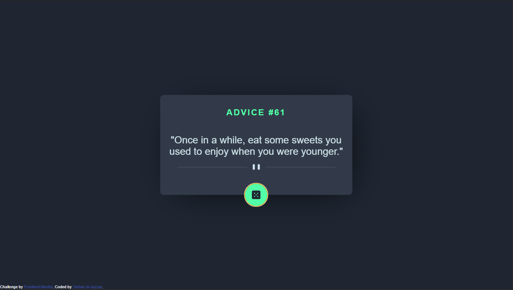
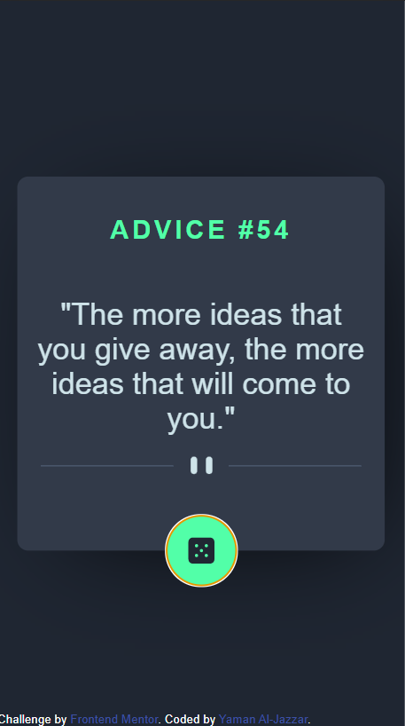

# Frontend Mentor - Advice generator app solution

This is a solution to the [Advice generator app challenge on Frontend Mentor](https://www.frontendmentor.io/challenges/advice-generator-app-QdUG-13db). Frontend Mentor challenges help you improve your coding skills by building realistic projects.

## Table of contents

- [Overview](#overview)
  - [The challenge](#the-challenge)
  - [Screenshot](#screenshot)
  - [Links](#links)
- [My process](#my-process)
  - [Built with](#built-with)
  - [What I learned](#what-i-learned)

**Note: Delete this note and update the table of contents based on what sections you keep.**

## Overview

### The challenge

Users should be able to:

- View the optimal layout for the app depending on their device's screen size
- See hover states for all interactive elements on the page
- Generate a new piece of advice by clicking the dice icon

### Screenshot
#### desktop version

#### mobile version


### Links

- Solution URL: [codebase](https://github.com/YAMANX8/advice-generator-app-main)
- Live Site URL: [github pages](https://yamanx8.github.io/advice-generator-app-main/)

## My process

### Built with

- Semantic HTML5 markup
- CSS custom properties
- Flexbox
- CSS Grid
- Mobile-first workflow
- SASS
- BEM Methodology
- Fetch API
### What I learned

this is the first time I practice fetch api and using async/await:
```js
async function getAdvice() {
  try {
    const getRequst = await fetch(url);
    if (getRequst.status === 404) {
      throw new Error("Page not found");
    } else if (getRequst.status === 500) {
      throw new Error("Server error");
    } else if (!getRequst.ok) {
      throw new Error(`HTTP error! status: ${getRequst.status}`);
    }
    const getJson = await getRequst.json();
    setData(getJson.slip);
    //after getting the result, show the animation
    cardTxt.classList.remove("card-para--fadeOut");
    cardTxt.classList.add("card-para--fadeIn");
  } catch {
    (err) => console.log(err);
  }
}
```